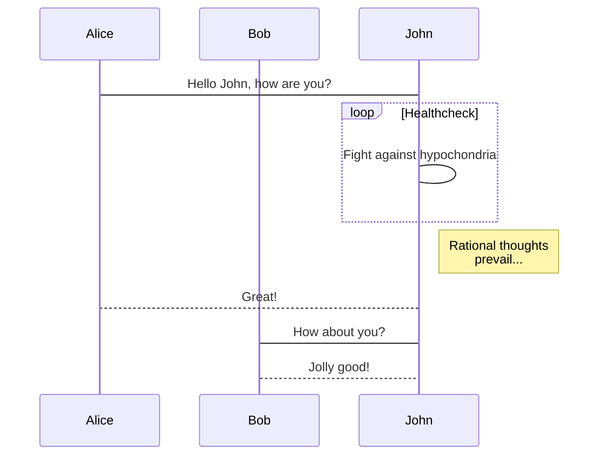
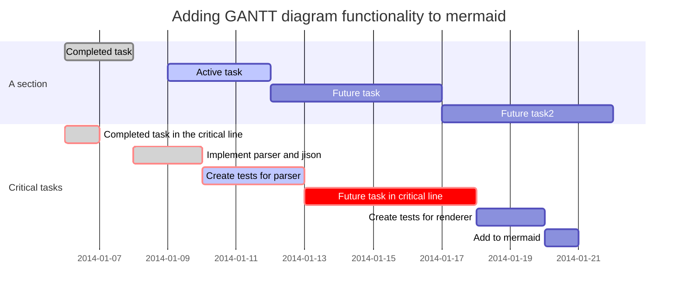

#### mermaid配置方法
1. npm安装插件
2. blog根目录config文件中添加配置
3. 主题文件中添加过滤标签
4. 补充：blog根目录中package.json文件中添加依赖（参考文章中没有提到）

<!--more-->

参考文章：

    https://www.liuyude.com/How_to_make_your_HEXO_blog_support_handwriting_flowchart.html
    https://github.com/webappdevelp/hexo-filter-mermaid-diagrams

####  hexo绘制脑图

参考文章：

    https://qsli.github.io/2017/01/01/markdown-mindmap/
    https://github.com/HunterXuan/hexo-simple-mindmap

#### 配置完成后，使用mermaid语法

##### 流程图

##### 时序图

##### 甘特图

##### 脑图

- [在 Hexo 中使用思维导图](https://hunterx.xyz/use-mindmap-in-hexo.html)
  - 前言
  - 操作指南
    - 准备需要的文件
    - 为主题添加 CSS/JS 文件
  - 使用方法
