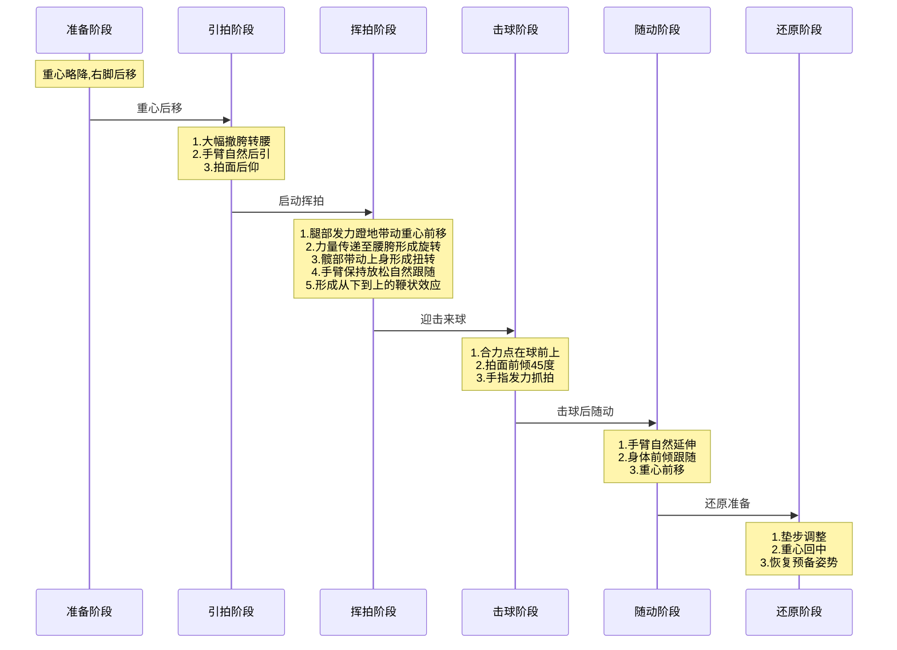
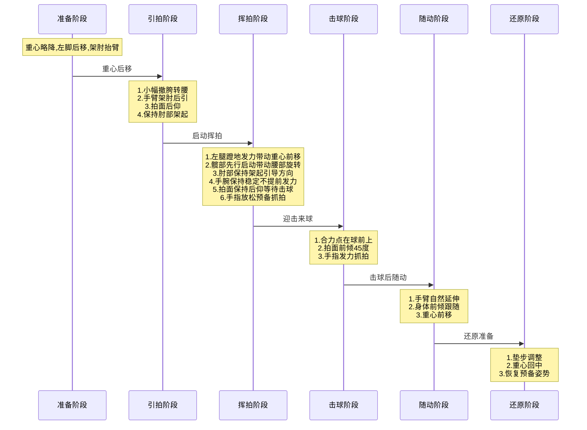

## 基本功

### 握拍技巧

#### 正手利选手
- **握拍方式**
  - 食指和拇指呈"V"形自然握持
  - 其余三指放松环绕拍柄
  - 拍面与前臂夹角约100-110度

#### 反手利选手  
- **握拍方式**
  - 拇指略微展开平放
  - 食指位置靠前
  - 拍面与前臂夹角约80-90度

### 站位要领

#### 正手利选手
- **基础站位**
  - 偏右半台为主
  - 重心略偏右脚
  - 便于正手进攻和衔接

#### 反手利选手
- **基础站位**
  - 偏中间位置
  - 重心相对居中
  - 保持对两侧的控制能力
  - 兼顾反手进攻和防守转换

#### 共同要点
- 保持膝盖微屈
- 重心前倾约15度
- 双脚与肩同宽
- 随时准备快速移动

### 站位优势分析

#### 正手利选手偏左站位优势
1. **进攻优势**
   - 更容易形成正手抢攻
   - 扩大正手击球范围
   - 减少反手区域面积

2. **移动优势**
   - 便于正手位快速启动
   - 容易完成侧身动作
   - 有利于前后台调动

#### 反手利选手中间站位优势
1. **技术优势**
   - 平衡两侧控制区域
   - 反手进攻更加灵活
   - 便于快速调整位置

2. **战术优势**
   - 兼顾台内短球控制
   - 便于处理对手变线球
   - 提高整体防守能力
   - 减少死角

### 正手拉球时序图

### 正手启动挥拍阶段详解
#### 1. 下肢发力
- **右腿蹬地**
  - 脚掌全面着地
  - 由后向前蹬地发力
  - 带动重心前移

- **重心转换**
  - 由后向前平稳过渡
  - 保持身体稳定性
  - 不要过早前倾

#### 2. 核心带动
- **髋部启动**
  - 先于上半身发力
  - 大幅度旋转带动
  - 保持身体协调

- **腰部跟随**
  - 自然跟随髋部旋转
  - 形成良好扭转
  - 维持核心稳定

#### 3. 上肢配合
- **手臂放松**
  - 保持自然后引
  - 不要主动发力
  - 跟随身体转动

- **拍面控制**
  - 保持后仰角度
  - 等待击球时机
  - 为抓拍做准备

### 反手拉球时序图

### 反手启动挥拍阶段详解

#### 1. 下肢发力
- **左腿蹬地**
  - 脚掌全面着地
  - 由后向前蹬地发力
  - 带动重心前移

- **重心转换**
  - 由后向前平稳过渡
  - 保持身体稳定性
  - 不要过早前倾

#### 2. 核心带动
- **髋部启动**
  - 先于上半身发力
  - 小幅度旋转带动
  - 保持身体协调

- **腰部跟随**
  - 自然跟随髋部旋转
  - 不要过度扭转
  - 维持核心稳定

#### 3. 上肢控制
- **肘部**
  - 保持架起姿势
  - 引导击球方向
  - 避免下垂

- **手腕**
  - 保持稳定
  - 不提前发力
  - 等待击球时刻

- **拍面**
  - 保持后仰角度
  - 准备击球角度
  - 避免提前调整

- **手指**
  - 保持放松
  - 准备抓拍发力
  - 不要提前用力

#### 4. 注意事项
- 动作要协调连贯
- 各部位发力要有先后次序
- 保持身体稳定性
- 为击球做好准备

### 常见问题及解决方案

1. **力量不足**
   - 检查髋部发力
   - 优化合力点位置
   - 加强核心力量训练

2. **击球不稳**
   - 控制挥拍幅度
   - 稳定击球点
   - 加强基本功训练

3. **动作不协调**
   - 分解动作练习
   - 慢动作体会
   - 多球训练巩固

### 步法
- 并步
- 跨步
- 跳步

### 发球
- 正手发球
- 反手发球

### 接发球
- 正手接发球
- 反手接发球

## 正手体系打法

### 发球抢攻体系
- **基础发球**
  - 正手位快速下旋发球（靠近球台）
  - 反手位短下旋发球（抢攻准备）
  - 长球发球（直接得分或逼迫对手回球质量）

- **抢攻技术**
  - 第三板快速弧圈球（对方回球较高时）
  - 第三板快带（对方回球较低时）
  - 第三板爆冲（对方回球较软时）

- **站位要领**
  - 发球后快速移动到球台中间偏右位置
  - 保持重心前倾，随时准备移动
  - 注意观察对手站位和准备动作

### 相持阶段打法
- **正手位控制**
  - 中台弧圈球（基本进攻）
  - 快速侧身抽球（强势进攻）
  - 台内快带（抢攻反击）

- **步法配合**
  - 并步移动（左右移动基础）
  - 跨步抽球（扩大击球范围）
  - 跳步调整（快速回位）

## 反手体系打法

### 近台快攻体系
- **基本站位**
  - 偏左站位（便于反手控制）
  - 重心略降低（提高稳定性）
  - 手肘保持适当距离（便于快速反应）

- **技术要点**
  - 反手快速推挡（基础技术）
  - 反手快攻（主要得分手段）
  - 反手搓球（变化技术）

- **战术应用**
  - 反手位发球后快攻
  - 台内快速相持
  - 适时结合正手进攻

### 实战技巧

#### 发球技巧
- **短球发球**
  - 球要触网，降低高度
  - 加强旋转变化
  - 注意发球动作相似性

- **长球发球**
  - 突然加快速度
  - 改变落点
  - 结合战术意图

#### 接发球技巧
- **短球处理**
  - 轻推短球（保持主动）
  - 突然搓长（打乱对手节奏）
  - 快速推攻（抢攻机会）

- **长球处理**
  - 快速弧圈球（抢攻为主）
  - 侧身抽球（强势进攻）
  - 稳健推挡（保持相持）

## 实战训练方法

### 基础训练
1. **多球训练**
   - 固定落点移动训练
   - 不固定落点移动训练
   - 发球抢攻专项训练

2. **对打训练**
   - 单一技术对打
   - 组合技术对打
   - 实战模拟对打

### 进阶训练
1. **战术演练**
   - 发球后三板战术
   - 接发球后四板战术
   - 相持阶段战术

2. **实战模拟**
   - 11分制比赛
   - 特定分数段练习
   - 不同打法对抗

## 常见问题解决

### 技术问题
- **发球不稳定**
  - 检查抛球高度
  - 保持动作一致
  - 控制触球部位

- **击球不到位**
  - 调整站位距离
  - 检查击球点
  - 加强步法训练

### 战术问题
- **无法形成进攻**
  - 改善发球质量
  - 提高抢攻意识
  - 加强战术训练

- **易失误**
  - 降低击球力量
  - 提高击球稳定性
  - 选择合适进攻时机
