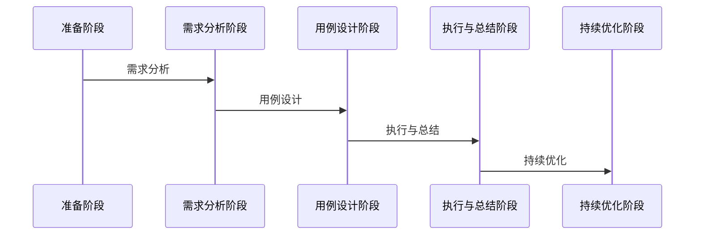

## 测试用例准备时序图

## 一、需求分析阶段

### 1. 需求描述解读
- **需求背景分析**
  - 业务目标理解
  - 解决什么问题
  - 预期收益评估

- **模块定位**
  - 在整体链路中的位置
  - 上下游依赖关系
  - 输入输出预期

- **边界识别**
  - 测试范围界定
  - 不可测范围说明
  - 风险点评估

#### 需求分析矩阵
| 维度 | 分析要点 | 关注重点 | 输出物 |
|------|----------|----------|--------|
| 业务目标 | - 解决的核心问题 - 预期收益 - 成功标准 | - 目标是否明确 - 收益是否可衡量 - 标准是否合理 | - 目标分析文档 - 收益评估表 |
| 功能范围 | - 核心功能点 - 可选功能 - 排除功能 | - 功能完整性 - 优先级划分 - 边界条件 | - 功能清单 - 优先级矩阵 |
| 技术实现 | - 技术方案 - 架构设计 - 接口规范 | - 方案可行性 - 架构合理性 - 接口规范性 | - 技术评审意见 - 风险清单 |
| 数据需求 | - 数据来源 - 数据格式 - 数据量级 | - 数据准确性 - 数据完整性 - 性能要求 | - 数据流程图 - 数据字典 |
| 质量要求 | - 性能指标 - 稳定性要求 - 安全要求 | - 指标合理性 - 监控方案 - 应急预案 | - 质量标准表 - 监控方案 |

### 2. 技术文档评审

#### 2.1 预期一致性确认
- 与需求文档的匹配度
- 技术实现的可行性
- 潜在风险点识别

#### 2.2 数据流转分析
- **数据链路梳理**
  - 数据源头确认
  - 中间存储介质
  - 最终落地位置
  - 数据同步机制

- **关键节点识别**
  - 定时任务特性
  - 数据一致性要求
  - 性能瓶颈点

- **监控方案设计**
  - 数据监控指标
  - 异常告警机制
  - 问题追溯方法

#### 2.3 业务逻辑分析
- **时序图梳理**
  - 核心流程
  - 改动点影响
  - 异常处理机制

#### 2.4 技术文档评审矩阵
| 维度 | 分析要点 | 关注重点 | 输出物 |
|------|----------|----------|--------|
| 业务目标 | - 解决的核心问题 - 预期收益 - 成功标准 | - 目标是否明确 - 收益是否可衡量 - 标准是否合理 | - 目标分析文档 - 收益评估表 |
| 功能范围 | - 核心功能点 - 可选功能 - 排除功能 | - 功能完整性 - 优先级划分 - 边界条件 | - 功能清单 - 优先级矩阵 |
| 技术实现 | - 技术方案 - 架构设计 - 接口规范 | - 方案可行性 - 架构合理性 - 接口规范性 | - 技术评审意见 - 风险清单 |
| 数据需求 | - 数据来源 - 数据格式 - 数据量级 | - 数据准确性 - 数据完整性 - 性能要求 | - 数据流程图 - 数据字典 |
| 质量要求 | - 性能指标 - 稳定性要求 - 安全要求 | - 指标合理性 - 监控方案 - 应急预案 | - 质量标准表 - 监控方案 | 

## 二、测试用例设计

### 1. 测试策略制定
- **测试类型划分**
  - 功能测试
  - 性能测试
  - 接口测试
  - 数据测试

- **测试优先级**
  - P0核心功能
  - P1重要功能
  - P2一般功能
  - P3低优先级功能

### 2. 用例设计原则
- **可测性评估**
  - 数据构造难度
  - 环境依赖程度
  - 测试成本评估

- **覆盖度要求**
  - 功能覆盖
  - 场景覆盖
  - 数据覆盖
  - 异常覆盖

### 3. 测试数据准备
- **数据构造方案**
  - 构造方法说明
  - 数据固化方案
  - 数据清理机制

- **数据管理**
  - 版本控制
  - 环境隔离
  - 数据保护

### 测试用例设计矩阵
| 维度 | 分析要点 | 关注重点 | 输出物 |
|------|----------|----------|--------|
| 测试类型 | - 功能测试 - 性能测试 - 接口测试 - 数据测试 | - 测试类型是否全面 - 测试优先级是否合理 - 测试数据是否充分 | - 测试用例设计文档 - 测试数据字典 |
| 测试优先级 | - P0核心功能 - P1重要功能 - P2一般功能 - P3低优先级功能 | - 测试优先级是否合理 - 测试数据是否充分 - 测试成本是否可接受 | - 测试用例设计文档 - 测试数据字典 |
| 测试数据 | - 数据构造方案 - 数据管理机制 - 数据清理机制 | - 数据构造是否可行 - 数据管理是否有效 - 数据清理是否及时 | - 测试用例设计文档 - 测试数据字典 |
| 测试覆盖 | - 功能覆盖 - 场景覆盖 - 数据覆盖 - 异常覆盖 | - 测试覆盖是否全面 - 测试场景是否多样 - 测试数据是否充分 - 测试异常是否充分 | - 测试用例设计文档 - 测试数据字典 |

## 三、执行与总结

### 1. 测试执行过程
- **问题跟踪**
  - 问题分类统计
  - 解决方案追踪
  - 回归验证确认

- **文档更新**
  - 测试方案调整
  - 用例优化记录
  - 经验总结沉淀

### 2. 测试报告输出
- **测试范围说明**
  - 计划vs实际对比
  - 未覆盖项说明
  - 风险评估结果

- **质量评估**
  - 问题统计分析
  - 质量结论
  - 遗留风险说明

### 3. 上线准备清单
- **依赖关系确认**
  - 数据依赖
  - 服务依赖
  - 开关配置

- **回滚方案**
  - 数据回滚
  - 服务回滚
  - 配置回滚

### 3. 测试报告输出矩阵
| 维度 | 分析要点 | 关注重点 | 输出物 |
|------|----------|----------|--------|
| 测试范围 | - 计划vs实际对比 - 未覆盖项说明 - 风险评估结果 | - 测试范围是否全面 - 未覆盖项是否合理 - 风险评估是否充分 | - 测试报告 - 测试总结 |
| 质量评估 | - 问题统计分析 - 质量结论 - 遗留风险说明 | - 问题是否全面 - 质量结论是否合理 - 遗留风险是否可接受 | - 测试报告 - 测试总结 | 

## 四、持续优化建议

1. **流程优化**
   - 自动化覆盖
   - 工具改进
   - 效率提升

2. **经验沉淀**
   - 问题复盘
   - 最佳实践
   - 知识共享

3. **能力提升**
   - 技术栈扩展
   - 业务理解深化
   - 测试方法创新

### 持续优化矩阵
| 维度 | 分析要点 | 关注重点 | 输出物 |
|------|----------|----------|--------|
| 流程优化 | - 自动化覆盖 - 工具改进 - 效率提升 | - 自动化覆盖是否全面 - 工具改进是否有效 - 效率提升是否显著 | - 持续优化建议 |
| 经验沉淀 | - 问题复盘 - 最佳实践 - 知识共享 | - 问题复盘是否深入 - 最佳实践是否可行 - 知识共享是否充分 | - 持续优化建议 |
| 能力提升 | - 技术栈扩展 - 业务理解深化 - 测试方法创新 | - 技术栈扩展是否全面 - 业务理解是否深化 - 测试方法是否创新 | - 持续优化建议 | 