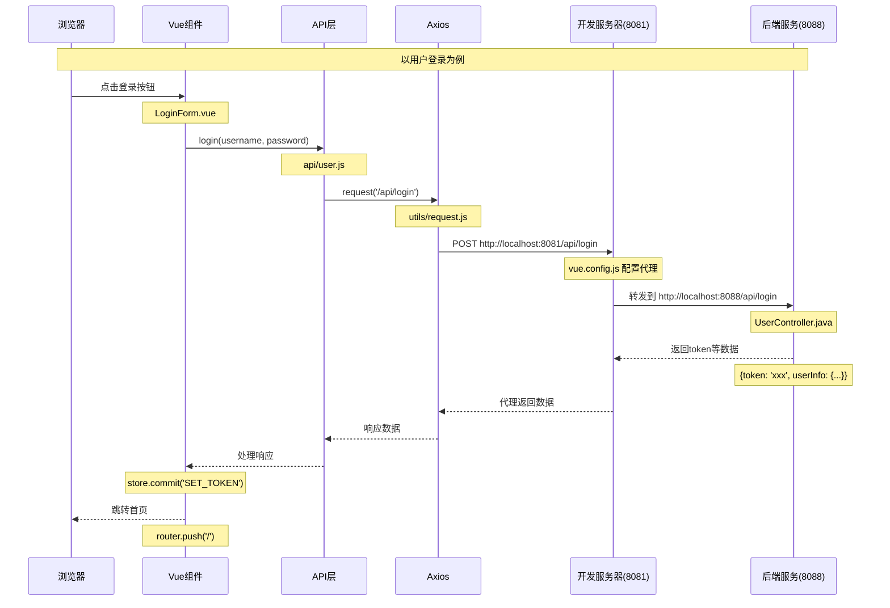

# 前后端交互流程说明

## 一、Vue 项目目录结构

```
sports-h5/
├── public/                 # 静态资源目录
│   └── index.html         # HTML 模板
├── src/                   # 源代码目录
│   ├── api/              # API 接口定义
│   │   ├── user.js       # 用户相关接口
│   │   └── points.js     # 积分相关接口
│   ├── components/       # 公共组件
│   │   └── layout/      # 布局组件
│   ├── views/           # 页面组件
│   │   ├── user/        # 用户相关页面
│   │   ├── games/       # 赛事相关页面
│   │   └── points/      # 积分相关页面
│   ├── router/          # 路由配置
│   │   └── index.js     # 路由定义
│   ├── utils/           # 工具函数
│   │   └── request.js   # Axios 请求封装
│   ├── App.vue          # 根组件
│   └── main.js          # 入口文件
├── package.json          # 项目配置
└── vue.config.js        # Vue CLI 配置
```

## 二、请求流程时序图



### 代理配置说明 (vue.config.js)
```javascript
module.exports = {
  devServer: {
    port: 8081,  // 前端开发服务器端口
    proxy: {
      '/api': {  // 匹配所有 /api 开头的请求
        target: 'http://localhost:8088',  // 后端服务器地址
        changeOrigin: true,  // 支持跨域
        // pathRewrite: {  // 如果需要去掉 /api 前缀，可以启用这个配置
        //   '^/api': ''
        // }
      }
    }
  }
}
```

### 请求流程说明

1. **前端开发环境 (8081端口)**
   - 运行 `npm run serve` 启动开发服务器
   - 提供热更新功能
   - 处理静态资源
   - 配置代理规则

2. **代理转发过程**
   - 前端请求 `http://localhost:8081/api/xxx`
   - 开发服务器匹配到 `/api` 前缀
   - 根据代理配置转发到 `http://localhost:8088/api/xxx`
   - 后端处理请求并返回数据
   - 开发服务器将响应转发回前端

3. **后端服务 (8088端口)**
   - 运行 SpringBoot 应用
   - 处理 API 请求
   - 返回数据给代理服务器

4. **跨域处理**
   - 前端配置代理解决开发环境跨域
   - 生产环境通常由 nginx 处理跨域
   - 后端也可以配置 CORS 支持跨域

## 三、关键代码示例

### 1. 前端组件 (LoginForm.vue)
```vue
<template>
  <van-form @submit="onSubmit">
    <van-field
      v-model="username"
      name="username"
      label="用户名"
      placeholder="请输入用户名"
      :rules="[{ required: true }]"
    />
    <van-field
      v-model="password"
      type="password"
      name="password"
      label="密码"
      placeholder="请输入密码"
      :rules="[{ required: true }]"
    />
    <div style="margin: 16px;">
      <van-button round block type="primary" native-type="submit">
        提交
      </van-button>
    </div>
  </van-form>
</template>

<script>
import { login } from '@/api/user'

export default {
  data() {
    return {
      username: '',
      password: ''
    }
  },
  methods: {
    async onSubmit() {
      try {
        const res = await login({
          username: this.username,
          password: this.password
        })
        // 存储token
        this.$store.commit('SET_TOKEN', res.data.token)
        // 跳转首页
        this.$router.push('/')
      } catch (error) {
        console.error(error)
      }
    }
  }
}
</script>
```

### 2. API封装 (api/user.js)
```javascript
import request from '@/utils/request'

export function login(data) {
  return request({
    url: '/api/login',
    method: 'post',
    data
  })
}

export function getUserInfo() {
  return request({
    url: '/api/user/info',
    method: 'get'
  })
}
```

### 3. 请求工具 (utils/request.js)
```javascript
import axios from 'axios'
import store from '@/store'
import { Toast } from 'vant'

const service = axios.create({
  baseURL: process.env.VUE_APP_BASE_API,
  timeout: 5000
})

// 请求拦截器
service.interceptors.request.use(
  config => {
    const token = store.state.token
    if (token) {
      config.headers['Authorization'] = `Bearer ${token}`
    }
    return config
  },
  error => {
    return Promise.reject(error)
  }
)

// 响应拦截器
service.interceptors.response.use(
  response => {
    const res = response.data
    if (res.code !== 200) {
      Toast.fail(res.message)
      return Promise.reject(res.message)
    }
    return res
  },
  error => {
    Toast.fail(error.message)
    return Promise.reject(error)
  }
)

export default service
```

### 4. 后端控制器 (UserController.java)
```java
@RestController
@RequestMapping("/api")
public class UserController {
    
    @PostMapping("/login")
    public Result login(@RequestBody LoginRequest request) {
        // 验证用户名密码
        String token = userService.login(request);
        // 返回token和用户信息
        return Result.success(new HashMap<String, Object>() {{
            put("token", token);
            put("userInfo", userService.getUserInfo());
        }});
    }
    
    @GetMapping("/user/info")
    public Result getUserInfo() {
        return Result.success(userService.getUserInfo());
    }
}
```

### 5. 服务实现 (UserServiceImpl.java)
```java
@Service
public class UserServiceImpl implements UserService {
    
    @Override
    public String login(LoginRequest request) {
        // 验证用户名密码
        User user = userMapper.findByUsername(request.getUsername());
        if (user == null || !passwordMatch(request.getPassword(), user.getPassword())) {
            throw new BusinessException("用户名或密码错误");
        }
        // 生成token
        return JwtUtil.generateToken(user.getId());
    }
    
    @Override
    public UserInfo getUserInfo() {
        // 获取当前用户信息
        Long userId = SecurityUtils.getUserId();
        return userMapper.findUserInfoById(userId);
    }
}
```

## 四、请求示例流程

以用户更新为例：

1. **视图层触发**
```vue
<!-- UserEdit.vue -->
<template>
  <van-button @click="handleSave">保存</van-button>
</template>

<script>
import { updateUser } from '@/api/user'

export default {
  methods: {
    async handleSave() {
      const res = await updateUser(this.formData)
      // 处理响应
    }
  }
}
</script>
```

2. **API 层处理**
```javascript
// api/user.js
export function updateUser(data) {
  return request({
    url: '/user/update',
    method: 'post',
    data
  })
}
```

3. **请求转发**
- 前端发起请求：`http://localhost:8081/api/user/update`
- 开发服务器代理到：`http://localhost:8088/api/user/update`
- 后端处理请求并返回数据
- 数据通过代理返回给前端
- 组件接收数据并更新视图

## 五、端口转发说明

1. **前端开发服务器 (8081)**
- `npm run serve` 启动开发服务器
- 提供热更新
- 处理静态资源
- 配置代理规则

2. **后端服务器 (8088)**
- 提供 API 服务
- 处理业务逻辑
- 操作数据库
- 返回数据

3. **代理规则**
- 所有 `/api` 开头的请求都会被代理
- 自动转发到后端服务器
- 处理跨域问题
- 保持会话状态

## 六、数据渲染流程

1. **组件初始化**
```javascript
setup() {
  const formData = ref({})
  
  onMounted(async () => {
    const res = await getUserInfo()
    formData.value = res.data
  })
  
  return { formData }
}
```

2. **模板渲染**
```vue
<template>
  <div>{{ formData.nickname }}</div>
</template>
```

3. **响应式更新**
- 数据变化自动触发视图更新
- 使用 `v-model` 实现双向绑定
- 计算属性处理派生状态
- 监听器处理副作用 