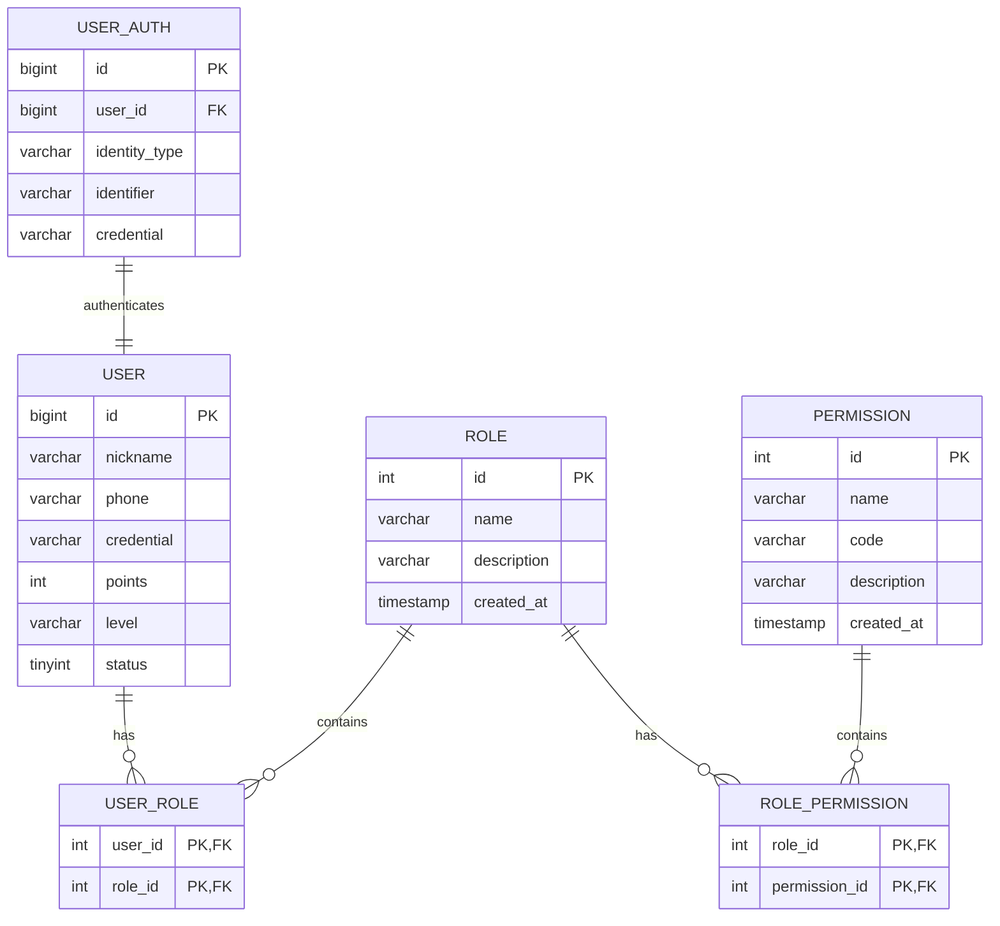
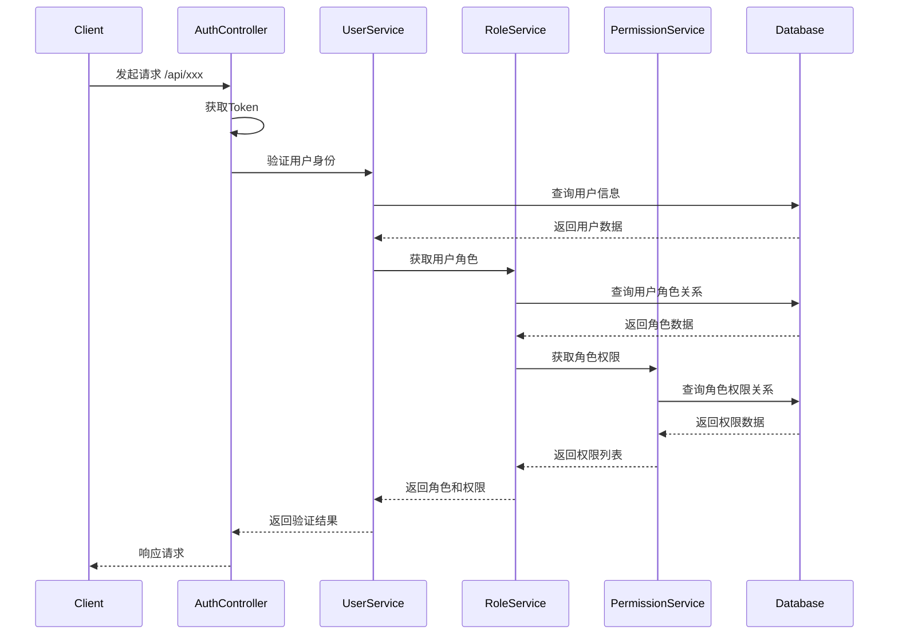
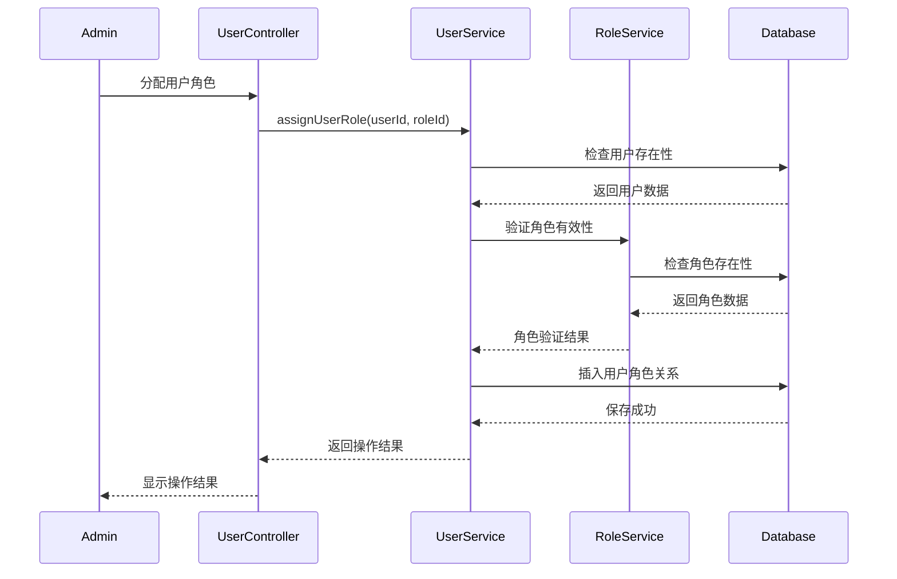
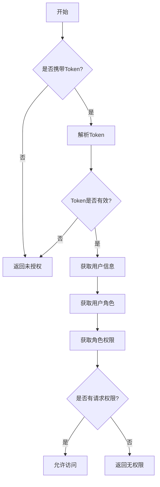

# 用户权限模型关系说明

## 一、数据表关系图

## 二、权限验证时序图

## 三、用户分配角色时序图

## 四、权限检查流程图

## 五、核心权限表说明

1. **用户表(user)**
   - 存储基本用户信息
   - 包含用户状态标识
   - 关联用户认证信息

2. **用户认证表(user_auth)**
   - 多种认证方式支持
   - 一个用户可以有多个认证方式
   - 认证凭证加密存储

3. **角色表(role)**
   - 预定义系统角色
   - 可自定义角色
   - 角色层级关系

4. **权限表(permission)**
   - 功能权限定义
   - 资源访问权限
   - 操作权限控制

5. **关联表**
   - user_role: 用户-角色多对多关系
   - role_permission: 角色-权限多对多关系

## 六、权限码设计规范

权限码格式：`模块:操作:资源`

例如：
- `user:create:*` - 创建任何用户
- `event:update:own` - 更新自己创建的赛事
- `points:read:all` - 查看所有积分信息
- `system:manage:*` - 系统管理权限
