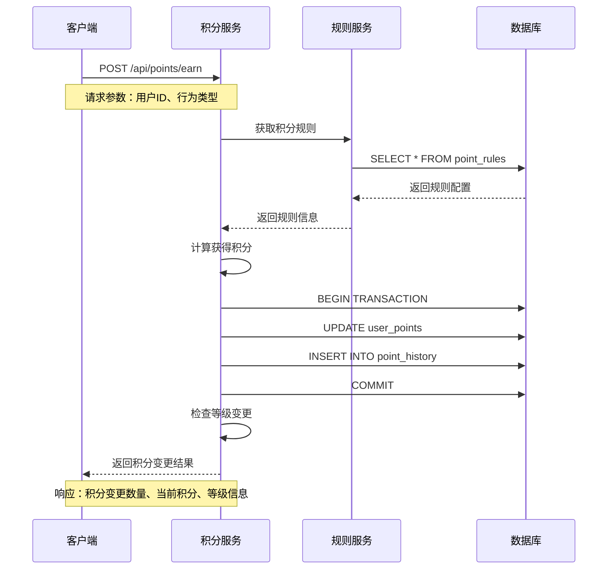
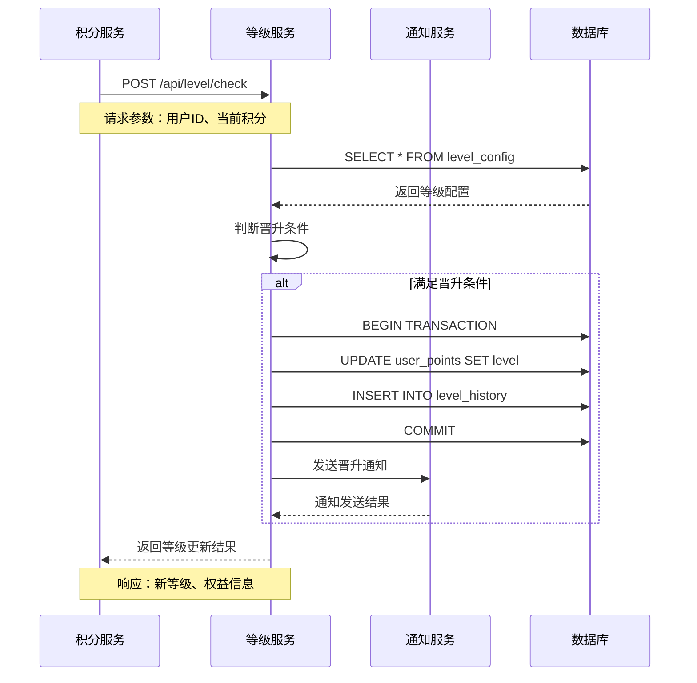

# 积分系统实现总结

## 一、系统架构

### 1. 核心模块
- 积分规则管理
- 积分计算引擎
- 等级晋升系统
- 积分历史记录

### 2. 数据模型
- 用户积分表：记录用户当前积分和等级
- 积分规则表：配置不同行为的积分规则
- 积分变更记录表：记录所有积分变动历史
- 等级配置表：定义不同等级的积分要求

## 二、数据流转

### 1. 积分获取流程
1. 触发积分场景（比赛结果、活动参与等）
2. 查询对应积分规则
3. 计算获取积分数
4. 更新用户积分
5. 记录积分变更
6. 触发等级检查

### 2. 等级晋升流程
1. 积分变更触发检查
2. 获取用户当前积分
3. 查询等级配置
4. 判断是否满足晋升条件
5. 执行等级更新
6. 发送晋升通知

## 三、关键功能实现

### 1. 积分规则管理
- 支持多种积分获取场景
- 灵活的规则配置
- 规则版本管理

### 2. 积分计算引擎
- 实时计算
- 批量处理能力
- 事务保证

### 3. 等级晋升系统
- 自动晋升判定
- 等级权益管理
- 晋升通知推送

### 4. 积分历史记录
- 完整的变更记录
- 支持多维度查询
- 数据统计分析

## 四、安全性保障

### 1. 数据安全
- 积分变更必须有明确来源
- 关键操作记录日志
- 防止重复计算

### 2. 业务安全
- 规则变更审核机制
- 异常变更监控
- 定期数据核对

## 五、性能优化

### 1. 查询优化
- 合理使用缓存
- 索引优化
- 分页查询

### 2. 计算优化
- 批量处理
- 异步计算
- 定时任务

## 六、后续优化方向

### 1. 功能扩展
- 积分兑换系统
- 积分有效期管理
- 特殊积分活动

### 2. 性能提升
- 引入分布式缓存
- 优化计算逻辑
- 添加预警机制

### 3. 运营支持
- 数据分析报表
- 运营活动支持
- 用户行为分析